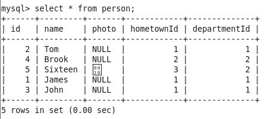
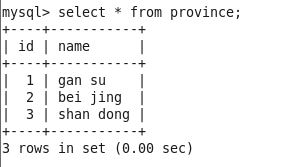
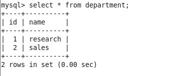
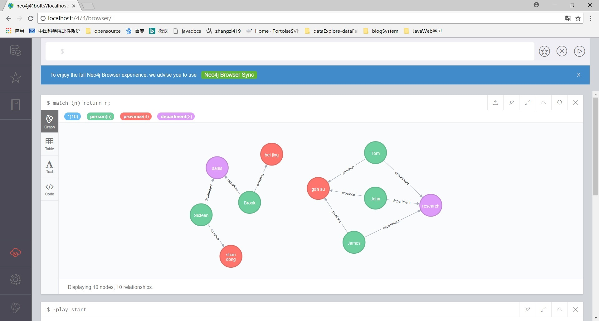

rdb2pidb使用说明
================
 
提纲
----
1、简介 
2、使用案例
3、总结

1、简介
-------
rdb2pidb是用来将关系型数据库中的数据导入到pidb中的输入导入工具。  

它支持每次从一个主表和多个关联表导入数据。  

比如，有一个person表，
它其中有一个列是hometownId，是一个外键，连接到了province表的id字段上，
另外有一个字段departmentId，也是一个外键，连接到department表的id字段上，
那么这里主表是person表，关联表是province表（通过hometownId外键关联到province表）
和department表（通过departmentId外键关联到department表），那么在导入主表person的时候，就会一次性连同province表和department表一并导入。  

不过，用户需要在配置文件conf/rdb2gdb.conf中配置主表和关联表的字段信息(这里配置文件名字叫rdb2gdb.conf是因为pidb本质上一个图数据库graph database)。  

2、使用案例
-----------
这一节通过上一节的例子中的person表的导入，来说明如何使用rdb2gdb。  

通过上节的举例可以知道，主表是person表，关联表是province表和department表。
本次导入以person表为主，由于person表中关联了province表和department表，
所以也一并导入province表和department表。  

本次导入分为如下步骤完成：

(1)  配置配置文件rdb2gdb.conf 
(2)  执行导入 
(3)  查看导入结果 

(1)  配置配置文件rdb2gdb.conf 
要导入的主表是person，关联表是province和department，
这个三个表的字段信息都要配置到rdb2gdb.conf中去。 
具体配置如下：
> 
>{ 
>  //关系数据库的信息 
>  "url4Rdb": "jdbc:mysql://192.168.192.129:3306/test", 
>  "rUserName": "root", 
>  "rPassword": "123456", 
>  "rdbDriverClass": "com.mysql.jdbc.Driver", 
> 
>  //要导入的目标表的信息 
>  "tableName": "person", 
>  "cols": [ 
>    { 
>      "colName": "id", 
>      /* 可以取如下几个值v 
>          Number(bit, tinyint, samllint, mediumint, int, integer, bigint, float, decimal, dec, real, double) 
>        | String(char, varchar, tinytext, mediumtext, longtext, text, binary, varbinary, enum, set) 
>        | Boolean(bool, boolean) 
>        | Datetime(time, date, datetime, timestamp, year) 
>        | Blob(tinyblob, mediumblob, longblob) 
>      */ 
>      "colType": "int" 
>    }, 
>    { 
>      "colName": "name", 
>      "colType": "String" 
>    }, 
>    { 
>      "colName": "photo", 
>      "colType": "Blob" 
>    }, 
>    { 
>      "colName": "hometownId", 
>      "colType": "int" 
>    }, 
>    { 
>      "colName": "departmentId", 
>      "colType": "int" 
>    } 
>  ], 
> 
>  //外键信息 
>  "foreignKeys": 
>  [ 
>    { 
>      "foreignKey": "hometownId", 
>      "referenceKey": "id", 
>      "foreignKeyDesc": "foreign key(hometownId) references province(id)", 
>      "referenceTableInfo": 
>      { 
>        "tableName": "province", 
>        "cols": [ 
>          { 
>            "colName": "id", 
>            "colType": "int" 
>          }, 
>          { 
>            "colName": "name", 
>            "colType": "String" 
>          } 
>        ] 
>      } 
>    }, 
>    { 
>      "foreignKey": "departmentId", 
>      "referenceKey": "id", 
>      "foreignKeyDesc": "foreign key(departmentId) references department(id)", 
>      "referenceTableInfo": 
>      { 
>        "tableName" : "department", 
>        "cols": 
>        [ 
>          { 
>            "colName": "id", 
>            "colType": "int" 
>          }, 
>          { 
>          "colName": "name", 
>          "colType": "String" 
>           } 
>        ] 
>      } 
>    } 
>  ], 
> 
>  //图数据库的连接信息 
>  "url4Gdb": "bolt://localhost:7687", 
>  "gUserName": "neo4j", 
>  "gPassword": "123456", 
>} 
>  

person表、province表、department表的数据情况如下： 

 
图1  person表中的数据 

 
图2 province表中的数据 

 
图3 department表中的数据 

(2)执行导入 

配置好配置文件之后，要导入的主表、关联表等信息就设置好了，接下来需要做的就是执行导入操作。 

>java -jar rdb2pidb.jar 

导入的时候，会给每条记录在pidb中建一个顶点，顶点之间有外键关联的会建一条表，边的标签就是关联表的表名。

(3)查看导入结果 

打开浏览器，在地址栏中输入http://localhost:7474，就可以打开pidb的browser（browser是pidb的基于web的图形化数据查询工具），输入用户名和密码就可以登陆browser了，之后，在查询语句输入框中，输入如下查询语句，并执行，就可以看到导入结果了：
> match (n) return n;

导入结果如下图所示： 

 
图4 导入结果 

结果说明： 

在图4的导入结果中，可以看到有三种颜色的顶点，分别是绿色5个，红色3个，紫色2个。
绿色的5个顶点代表了person表中的5条记录，红色的3个顶点代表了province表中的3条记录，紫色的2个顶点代表了department表中的2条记录。 

而各个顶点之间的边则代表了各个顶点之间的外键关系。以左边的这个联通子图为例来说明。
顶点Sixteen代表一个person表的记录，它的hometownId是3，连接到province表中就是shan dong这个顶点，因此，从Sixteen这个顶点就会有一条边到shan dong这个顶点，边的标签就是province。

Sixteen这个顶点的departmentId是2，连接到department表中就是sales这个顶点，因此，从Sixteen这个顶点到sales这个顶点就会有一条边，边的标签为department。

其他的顶点之间的关系以此类推。

3、总结
---------
从上面的介绍可以看出，rdb2pidb这个工具的使用方法是比较简洁的，也比较实用，希望用户多多使用，同时，把使用过程中遇到的问题反馈给我们，以便我们完善这个工具，使它的功能更加强大。

问题反馈可以发邮件到zhangzl419@cnic.cn。

